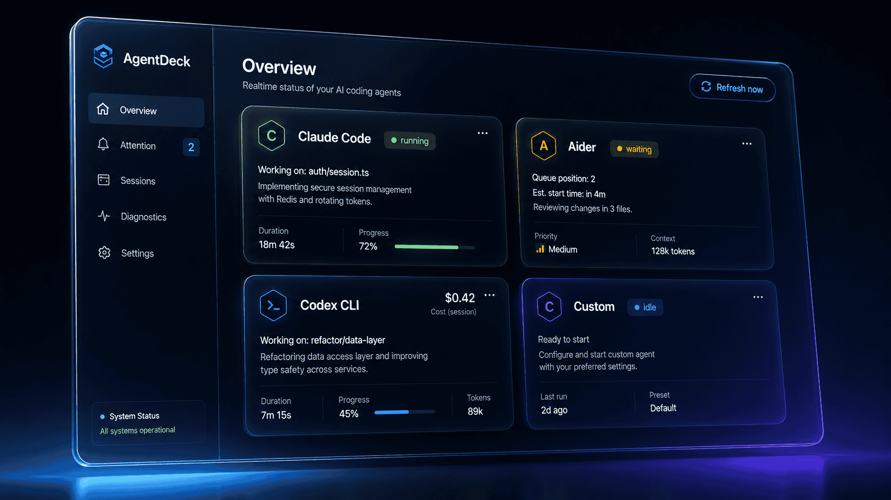

# AgentDeck

<p align="center">
  
</p>

> Local-first dashboard and Telegram remote for the AI coding assistants on your machine.

AgentDeck watches the AI coding assistants you have running on your computer (Aider, Codex CLI, Claude Code, and any other process you configure) and gives you a single dashboard showing what each one is doing, whether it needs your attention, and how much it's costing you. It runs locally, keeps everything in a SQLite file under your home directory, and has no account or telemetry. A built-in Telegram bot lets you check status or stop a session from your phone; `/stop` requires a confirmation message before anything is terminated.

## Status

Alpha. The current build is `0.1.0-alpha.1`. Linux is the validation lead; macOS and Windows builds arrive at beta. See the [changelog](CHANGELOG.md) for what's in this release.

## What you get

- **Detection.** Built-in adapters for Aider, Codex CLI, and Claude Code, plus a user-defined regex matcher (against process name, command line, or working directory) you can configure from the dashboard.
- **One dashboard.** Five pages — Overview, Attention, Sessions, Diagnostics, Settings — refreshed by a 15-second background tick and the Refresh button.
- **Tray.** Live menu with active-session counts and the top attention items. Falls back to a dashboard window plus desktop notifications when the desktop has no tray (stock GNOME without AppIndicator, some Wayland sessions).
- **Cost, tags, export.** Per-session estimated cost based on adapter-declared rates. Tag sessions by project or client. Export the full session history to CSV or JSON.
- **Telegram remote.** Pairing through a one-time code, allowlisted user IDs, read-only commands (`/status`, `/agents`, `/attention`, `/session`), `/mute`, and `/stop` with mandatory `STOP <id>` confirmation. Rate-limited per user; every action is written to the local audit log.

## Install

End users: see [`docs/install.md`](docs/install.md) for the full prerequisites and AppImage notes. The short version:

```sh
# Debian / Ubuntu
sudo apt install ./agentdeck_0.1.0-alpha.1_amd64.deb

# Anywhere else on Linux
chmod +x ./agentdeck_0.1.0-alpha.1_amd64.AppImage
./agentdeck_0.1.0-alpha.1_amd64.AppImage
```

On first launch AgentDeck creates `~/.local/share/agentdeck/agentdeck.db`. Delete that file to reset.

## Build from source

```sh
# System libraries on Ubuntu 24.04 or similar:
sudo apt install -y libwebkit2gtk-4.1-dev libgtk-3-dev \
    libayatana-appindicator3-dev librsvg2-dev build-essential \
    pkg-config curl wget file

# Rust and pnpm:
curl https://sh.rustup.rs -sSf | sh -s -- -y
npm i -g pnpm@11

pnpm install --frozen-lockfile
pnpm tauri:dev      # dev loop with hot reload
pnpm tauri:build    # produces .deb + .AppImage in src-tauri/target/release/bundle/
```

CI runs the same gates: `cargo build / clippy -D warnings / test --workspace --locked` plus `pnpm typecheck` on every push. See [`docs/contributing.md`](docs/contributing.md) for the workspace layout and conventions.

## Privacy

The monitoring core is local. AgentDeck has no telemetry and makes no outbound connections on its own. When you enable the Telegram bot it talks to `api.telegram.org` and nothing else. The bot token is stored in the local SQLite file (plaintext at the alpha stage; OS-keychain at beta), and only paired Telegram user IDs receive any reply beyond the initial pairing prompt. Exports write to a path you pick via the OS save dialog.

More detail: [`docs/privacy.md`](docs/privacy.md) and [`docs/security.md`](docs/security.md).

## Known limitations

- Linux only in the alpha. macOS and Windows compile but no bundle is shipped yet.
- Binaries are unsigned. Verify the SHA-256 against the release page before installing.
- Every built-in adapter ships at Level 1 (presence detection only). Status-level classification (waiting, stalled, errored) is Level 2 work, planned for beta.
- `/stop` uses the platform default mechanism (`SIGTERM` on Unix, `taskkill /F /PID` on Windows). Per-adapter graceful-shutdown logic arrives with Level 4 control.
- The Telegram bot token sits in plaintext in the local database until OS-keychain storage lands at beta.
- No auto-update. Reinstall to upgrade.

## Reporting issues

Open a GitHub issue. Useful information to include:

- The AgentDeck version, visible in the app menu.
- Distro and desktop environment (`lsb_release -a`, `echo "$XDG_CURRENT_DESKTOP / $XDG_SESSION_TYPE"`).
- A screenshot of the Diagnostics page if the bug is detection-related.
- The output of `AGENTDECK_LOG=debug agentdeck` for crashes or unexpected behaviour.

If you've paired Telegram, do not attach `~/.local/share/agentdeck/agentdeck.db` — your bot token is in plaintext there.

## Documentation

- [Install](docs/install.md)
- [Adapter capabilities](docs/adapter-capabilities.md)
- [Telegram setup](docs/telegram-setup.md)
- [Privacy](docs/privacy.md)
- [Security](docs/security.md)
- [Contributing](docs/contributing.md)
- [Changelog](CHANGELOG.md)

## License

MIT. See [LICENSE](LICENSE).
